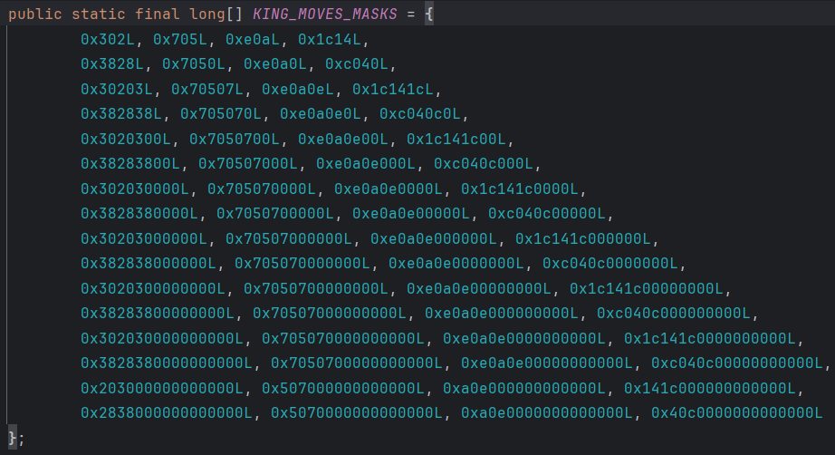
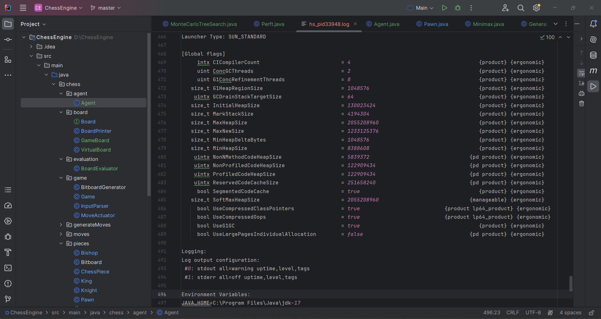

# AI Chess Engine Development Project Report ♟️🤖

## Introduction 🌐

This project focuses on the development of a chess engine, aiming to replicate and exceed human-level performance through advanced algorithms and optimizations. Chess engines are pivotal in artificial intelligence, requiring strategic decision-making and tactical analysis.

### Chess UI 🖼️

## Project Goals 🎯

The primary goals of this project include:
- Implementing efficient search algorithms for move generation.
- Designing robust evaluation functions for board positions.
- Optimizing performance through techniques like transposition tables and move ordering.

## Techniques Used 🔍

### 1. Search Algorithms 🔎

The project utilized the minimax algorithm enhanced with alpha-beta pruning to efficiently explore possible moves and evaluate their outcomes. This approach minimizes the search space while maximizing the depth of analysis.

### 2. Evaluation Functions 📊

An advanced evaluation function was crafted to assess board positions based on factors such as material balance, piece activity, pawn structure, and king safety. This function was crucial in determining the desirability of each move.

### 3. Transposition Tables 📝

Transposition tables were implemented to store previously evaluated board positions along with their scores. This caching mechanism optimized performance by avoiding redundant evaluations during the search process.

### 4. Move Ordering Strategies 🏃‍♂️

Heuristic-based move ordering strategies were employed to prioritize moves likely to lead to significant alpha-beta pruning cutoffs. This optimization reduced computational overhead and accelerated decision-making.

### 5. Killer Heuristics 💥

Killer heuristics were utilized to prioritize moves that caused beta cutoffs in previous searches. This heuristic improved move ordering and enhanced the efficiency of alpha-beta pruning.

### 6. Null Move Pruning 🚫

Null move pruning was implemented to skip certain positions where a temporary pass move (null move) is made to assess whether the opponent can still maintain their advantage. This technique reduced the depth of unnecessary subtree evaluations.

### 7. Quiescence Search 🌌

Quiescence search was employed to handle tactical variations by extending the search until a quiet position (without immediate tactical threats) is reached. This technique improved stability in evaluating positions during deeper searches.

### Chess Attack Masks ⚔️

## Results 📈

The chess engine demonstrated competitive performance against established benchmarks and human players:
- **Efficiency:** Optimized algorithms and data structures enabled rapid move generation and evaluation.
- **Accuracy:** The evaluation function accurately assessed board positions, reflecting strategic nuances.
- **Scalability:** Techniques such as parallelization and efficient memory management enhanced scalability on diverse hardware platforms.

### CPU Utilization 🖥️

### Heap Profile 📊

### Tests 🧪

## Conclusion 🎉

In conclusion, this chess engine development project successfully integrated advanced algorithms and optimizations to achieve robust performance and competitive gameplay. Future enhancements could explore hybrid approaches combining machine learning with traditional algorithms to further improve decision-making capabilities.

By leveraging fundamental principles and innovative techniques, this project contributes to advancements in artificial intelligence and game-playing systems, paving the way for intelligent applications in strategic domains.

#### If you have reached till here, Thank you! 😊
